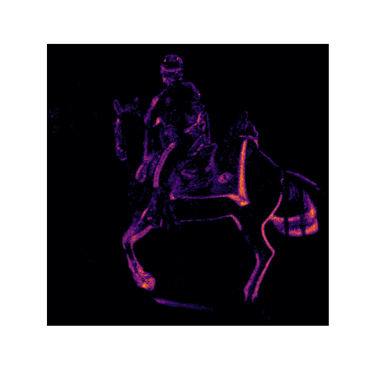

## Phase 2: Animation from Temporal Data
In this next level, the given coordinate data introduced a third dimension `t`, which is time in microseconds.

I upgraded the counter to process the coordinates in 50-millisecond windows. I utilized `pandas` to read the compressed csv data and `matplotlib.animation` to stitch these sequential frames together.

In the Time Loop located at cell 2 from `timed_counter_demo.ipynb`, 95 frames were generated. This is mathematically valid since the total stream duration of the data was 4.735 seconds. Dividing this by a 50-millisecond (0.050 seconds) window results in 94.7 which translates to 94 full frames and 1 partial frame.

The final result reveals that the static heatmap was actually a motion capture of a person riding a horse with several people walking in the background:

