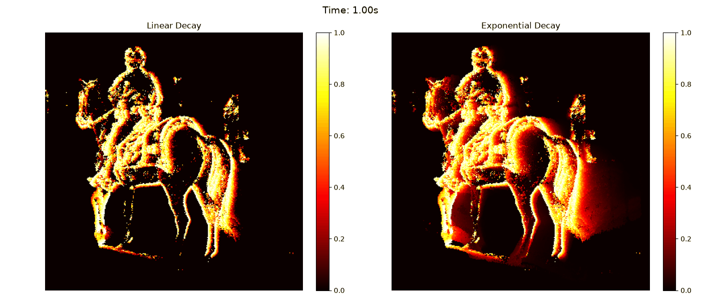

## Animation from Temporal Decay Data

In this next level, the given coordinate data introduced a third dimension `t`, which is time in microseconds.

I upgraded the logic to process the coordinates in 100-millisecond windows. I utilized an activator class from `decay.py` to calculate linear and exponential decay.

In the execution block of the notebook, 49 frames were generated. This is mathematically valid since the estimated total stream duration of the data is roughly 4.85 seconds. Dividing this by a 100-millisecond (0.100 seconds) window results in 48.5, which translates to 48 full frames and 1 partial frame.

The final result reveals the temporal motion paths that visualizes the fading trajectory of the coordinate activations over time:

