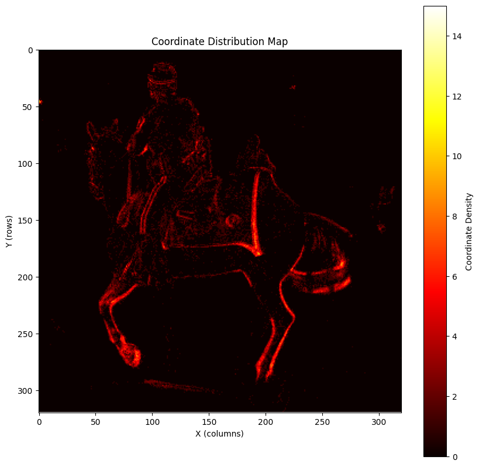

# Project Specifications: 2D Coordinate Counter

## Overview

Hi! This is the repository that contains my implementation of the 2D Coordinate Counter pet project. This task includes taking in a list of raw 2D coordinates from a `.csv` file and map it in a `320×320` grid. Building this really helped me understand how computers actually interpret and see 2D spatial data.

## Approach

I decided to avoid using heavy libraries like `pandas` or `numpy` so I could understand the logic of the project.

* **Grid Program:** I built the `CoordinateCounter` using standard Python lists. I learned that unlike the standard in Mathematics, in computer vision, `(x, y)` coordinates translates to `grid[y][x]` (Row first, then Column).

* **Data Processing:** I used the built-in `csv` module to parse `coordinates.csv` line by line where it manually converted the string data into integer coordinates.

## Visualization

The final step was setting up `coordinate_counter_demo.ipynb`. At first, I printed the grid and it gave me a wall of unreadable numbers. That made me realize why `matplotlib` or `plotly` was initially recommended. From that, I utilized `matplotlib` to visualize the grid into a heatmap. As I ran `plt.imshow()`, the raw data revealed a picture of a man riding a horse. As an Applied Mathematics student, it was a great way to see firsthand that an image is essentially just a giant grid of numbers.

Here is the statis visualization of the data:


## Original Assignment

Build a small Python project that reads a CSV file of 2D coordinates and accumulates how many times each coordinate appears in a fixed-size grid.

Included here is `coordinates.csv`. Details are as follows:
- Contains two integer columns: `x` and `y`
- Min and max value of either columns is 0 and 319, respectively.
    - This means all valid coordinates lie inside a `320 x 320` grid.
    - Starting at 0 (0-indexed), so all values are in $[0, 320)$ or $[0, 319]$
- It will look like something, once you graph the 2D array!
    - Do note: in computer vision, coordinate norms are:
        - `x` $(0 \to 319): (\text{left} \to \text{right})$
        - `y` $(0 \to 319): (\text{top} \to \text{bottom})$

## Project Goal

Implement a small Python module that:

1. Create a Python library / class that takes in coordinates.
2. Maintains a count grid over a fixed `320 x 320` grid.
3. Reads coordinates from `coordinates.csv`.
4. Updates the grid for each coordinate.

## Project Details

Define/Write the Coordinate Counter:

```python
class CoordinateCounter:
    def __init__(self, width: int, height: int):
        ...
        
    def update(self, x: int, y: int):
        ...
```

Sample usage:

```python
class Coordinate(NamedTuple):
    x: int
    y: int

coordinates: list[Coordinate] = ...  # contains the (x,y) pairs
coordinate_counter = CoordinateCounter(width=320, height=320)  # 320 is fixed for now for our data
for x,y in coordinates:
    coordinate_counter.update(x=x,y=y)
```

## Workflow

### Working Style

- This repository already includes:
    - `coordinate_counter.py`
    - `coordinates.csv`
    - this `README.md`
- Work on top of the provided scaffold rather than starting from scratch
    - Feel free to explore or change anything
- Treat this like a small real-world code task:
    - Fork the repository
    - Make small, logical commits as you progress
        - Use clear commit messages
        - This will serve as a "learning storyline"
    - Update the `README.md` if your implementation differs from the initial plan

### Submission

- Create a Jupyter notebook that uses your module/library/class
    - The notebook will also demo using `coordinates.csv` and show what it represents
- Share to me the GitHub link to your fork

## Tips & Pointers

- You may use `pandas` or `polars` to read the `.csv` file
- You may use `numpy` arrays to store the grid coordinate counts
- For visualizing it, use `matplotlib` or `plotly` (`plotly` is interactive)
- Though highly encouraged if you can demonstrate doing them in pure Python!

## License

Code in this repository is licensed under the [MIT License](LICENSE.md).

`coordinates.csv` is adapted from the [M3ED dataset](https://m3ed.io/) and is distributed under [CC BY-SA 4.0](https://creativecommons.org/licenses/by-sa/4.0/).

The attribution, source, and modification notice for that asset is in [ATTRIBUTION.md](ATTRIBUTION.md).
